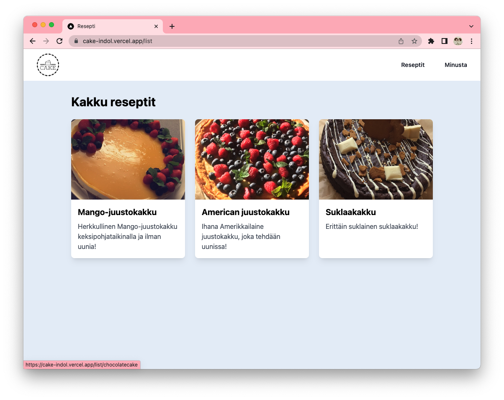

# Cake World

Kakku sivusto käytetty Next.js ja React.js

## Demo App

https://jennicake.vercel.app/

## Screenshots



## Getting Started

First, run the development server:

```bash
npm run dev
# or
yarn dev
# or
pnpm dev
```

Open [http://localhost:3000](http://localhost:3000) with your browser to see the result.

## License

[MIT](https://choosealicense.com/licenses/mit/)
